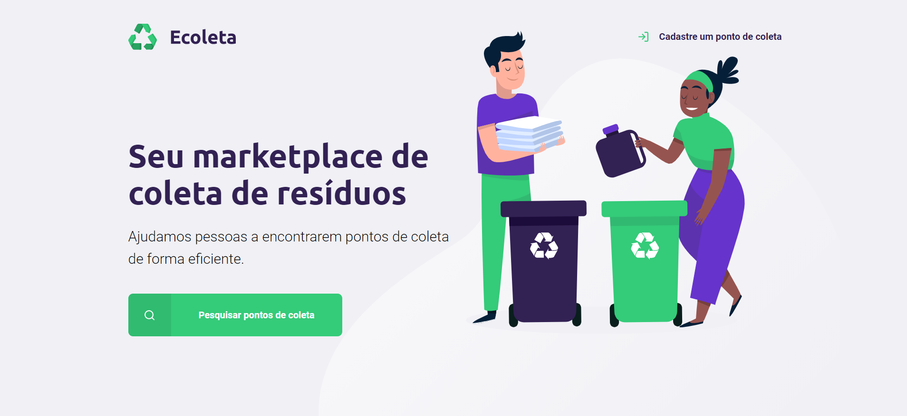

<div align="center">    
    <h1> Ecoleta </h1>
</div>

<div align="center">
    
</div>

# Indice
- [Sobre](#-sobre)
- [Tecnologias utilizadas](#-tecnologias-e-ferramentas-utilizadas)
- [Como baixar o projeto](#-como-baixar-o-projeto)

---

## 📝 Sobre
O projeto **Ecoleta** é um projeto que foi elaborado elaborado durante a **Next Level Week** da [Rocketseat](https://rocketseat.com.br). Foi um dos meus primeiros contatos com banco de dados.

---

## 🚀 Tecnologias e ferramentas utilizadas
O projeto foi desenvolvido utilizando as seguintes tecnologias:

- HTML
- CSS
- Node.js
- Nunjucks
- JavaScript

---

## 👇 Como baixar o projeto
```bash
    # Clonar o repositório
    $ git clone https://github.com/joaobrosin/ecoleta

    # Entrar no diretório
    $ cd ecoleta

    # Instalar as dependências
    $ yarn install

    # Iniciar o projeto
    $ yarn start
```
---

Desenvolvido por ***João Brosin***.